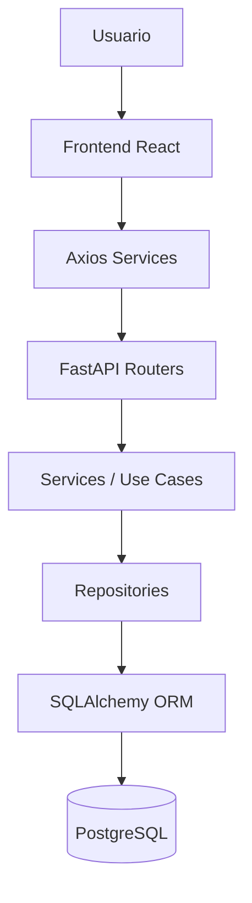
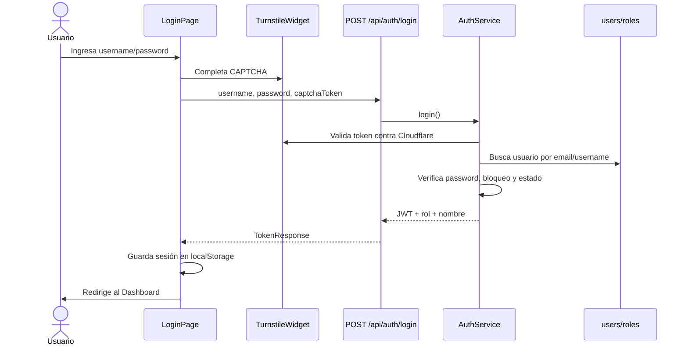
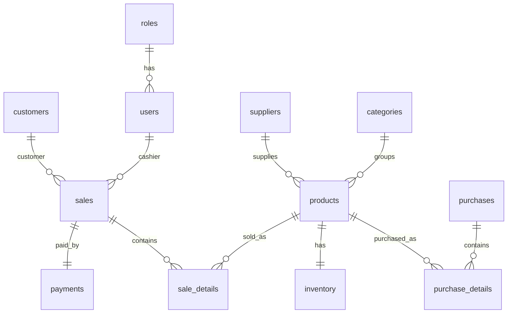

# Documentación Técnica de MeynaPOS

## 1. Descripción general del sistema

**MeynaPOS** es un sistema web de punto de venta e inventario orientado a pequeños y medianos negocios. El sistema integra autenticación con JWT, roles, gestión de productos, inventario, clientes, ventas, compras, usuarios, reportes, configuración del negocio, CAPTCHA con Cloudflare Turnstile y generación de recibos/facturas PDF desde el frontend.

Slogan del proyecto: **"Tecnología para crecer juntos"**.

El proyecto actual está compuesto por:

- **Backend**: FastAPI, SQLAlchemy, PostgreSQL, Pydantic, JWT, Pytest.
- **Frontend**: React, TypeScript, Vite, TailwindCSS, Axios, React Router, Recharts, jsPDF.
- **DevOps**: Docker, Docker Compose y GitHub Actions.

La arquitectura real sigue este flujo:

```text
Usuario
  -> Frontend React
  -> Axios / REST API
  -> FastAPI Routers
  -> Services
  -> Repositories
  -> SQLAlchemy ORM
  -> PostgreSQL
```

## 2. Estructura general del proyecto

Árbol real de carpetas y archivos relevantes:

```text
.
├── .github/
│   └── workflows/
│       └── ci.yml
├── backend/
│   ├── alembic.ini
│   ├── Dockerfile
│   ├── main.py
│   ├── requirements.txt
│   ├── alembic/
│   │   ├── env.py
│   │   ├── script.py.mako
│   │   └── versions/
│   │       └── 0001_initial_schema.py
│   └── app/
│       ├── api/
│       │   ├── router.py
│       │   └── routes/
│       ├── core/
│       ├── database/
│       ├── dependencies/
│       ├── middleware/
│       ├── models/
│       ├── repositories/
│       ├── schemas/
│       ├── services/
│       ├── tests/
│       └── utils/
├── frontend/
│   ├── Dockerfile
│   ├── index.html
│   ├── nginx.conf
│   ├── package.json
│   ├── postcss.config.js
│   ├── tailwind.config.js
│   ├── tsconfig.json
│   ├── vite.config.ts
│   └── src/
│       ├── assets/
│       ├── components/
│       ├── context/
│       ├── hooks/
│       ├── layouts/
│       ├── pages/
│       ├── routes/
│       ├── services/
│       ├── types/
│       └── utils/
├── docs/
│   └── TECHNICAL_DOCUMENTATION.md
├── docker-compose.yml
├── README.md
└── .gitignore
```

Carpetas no encontradas o removidas:

| Elemento | Estado |
| --- | --- |
| Exportaciones Figma externas (`Dashboard_MeynaPos`, `Inicio_sesion_MeynaPos`, `Modulo_Productos`, `Modulo_Ventas`) | No encontradas en el estado actual. Fueron retiradas de la carpeta base. |
| `node_modules` | No encontrado, correctamente excluido del repositorio. |
| `dist` | No encontrado, correctamente excluido del repositorio. |
| `docs/TECHNICAL_DOCUMENTATION.pdf` | Pendiente. Pandoc no está instalado en este entorno. Ver instrucciones al final. |

## 3. Explicación carpeta por carpeta

| Carpeta | Propósito | Contenido | Relación con el sistema |
| --- | --- | --- | --- |
| `.github/workflows` | Automatización CI/CD | Workflow `ci.yml` | Ejecuta pruebas, builds backend/frontend y builds Docker en GitHub Actions. |
| `backend` | Aplicación API REST | FastAPI, modelos, servicios, repositorios, pruebas y Dockerfile | Expone la API consumida por React y persiste datos en PostgreSQL. |
| `backend/alembic` | Migraciones versionadas | Configuración y migración inicial | Define esquema inicial y soporte para evolución de base de datos. |
| `backend/app/api` | Capa de entrada HTTP | Router principal y rutas por módulo | Agrupa endpoints REST y delega lógica a servicios. |
| `backend/app/core` | Configuración transversal | Configuración, seguridad, logging | Centraliza JWT, hashing de contraseñas, variables de entorno y logging. |
| `backend/app/database` | Infraestructura de datos | Singleton DB, seed, migraciones runtime | Administra engine/session SQLAlchemy, crea tablas y datos iniciales. |
| `backend/app/dependencies` | Dependencias FastAPI | Autenticación y autorización | Inyecta usuario actual y valida roles por endpoint. |
| `backend/app/middleware` | Middleware HTTP | Logging de requests | Añade comportamiento transversal en cada petición. |
| `backend/app/models` | Capa de dominio/persistencia ORM | Entidades SQLAlchemy | Representa tablas, relaciones y restricciones principales. |
| `backend/app/repositories` | Acceso a datos | Repositorios SQLAlchemy | Encapsula consultas y operaciones de persistencia. |
| `backend/app/schemas` | DTOs y validación | Modelos Pydantic | Define entradas/salidas de API. |
| `backend/app/services` | Casos de uso | Lógica de negocio | Orquesta reglas, repositorios y modelos. |
| `backend/app/tests` | Pruebas backend | Pytest | Valida autenticación, productos y ventas. |
| `backend/app/utils` | Utilidades | Factory de productos | Contiene patrones auxiliares. |
| `frontend` | Aplicación web | React, Vite, TypeScript, Tailwind | Interfaz del usuario, consume API mediante Axios. |
| `frontend/src/assets` | Recursos estáticos | Logo | Usado en login, layout y recibos. |
| `frontend/src/components` | Componentes reutilizables | Modal, tabla, formulario, Turnstile, métricas | Reduce duplicación en páginas. |
| `frontend/src/context` | Estado global | AuthContext | Maneja sesión y autenticación. |
| `frontend/src/hooks` | Hooks reutilizables | Barcode scanner | Soporta lectura de códigos de barras como teclado. |
| `frontend/src/layouts` | Estructura visual | MainLayout/AppLayout | Sidebar, header, breadcrumb y contenido central. |
| `frontend/src/pages` | Pantallas | Login, dashboard, ventas, reportes, etc. | Implementa módulos funcionales. |
| `frontend/src/routes` | Ruteo | AppRoutes, PrivateRoute, RoleGuard | Protege rutas por sesión y rol. |
| `frontend/src/services` | Cliente API | Servicios Axios por dominio | Conecta UI con backend. |
| `frontend/src/types` | Tipos TypeScript | Tipos API, auth y user | Tipado compartido de datos del frontend. |
| `frontend/src/utils` | Utilidades frontend | JWT, storage, recibo PDF | Funciones auxiliares de sesión y facturación. |
| `docs` | Documentación técnica | Este documento | Explica arquitectura y código del proyecto. |

## 4. Explicación archivo por archivo

### Archivos raíz

| Archivo | Propósito | Responsabilidades | Relación |
| --- | --- | --- | --- |
| `.gitignore` | Exclusiones Git | Evita subir `.env`, caches, builds, bases locales y dependencias | Protege secretos y reduce ruido del repositorio. |
| `docker-compose.yml` | Orquestación local | Levanta PostgreSQL, backend y frontend | Define red de servicios y variables de entorno de desarrollo. |
| `README.md` | Documentación inicial | Overview, setup, Docker, endpoints básicos | Documento de entrada del repositorio. |
| `.github/workflows/ci.yml` | Pipeline CI | Instala dependencias, corre tests, build Docker | Valida pushes y pull requests. |

### Backend: archivos de entrada y despliegue

| Archivo | Propósito | Responsabilidades | Dependencias |
| --- | --- | --- | --- |
| `backend/main.py` | Punto de entrada externo | Importa `app` desde `app.main` | Uvicorn/Docker. |
| `backend/Dockerfile` | Imagen backend | Instala requirements y ejecuta Uvicorn | Python 3.12 slim. |
| `backend/requirements.txt` | Dependencias Python | FastAPI, SQLAlchemy, JWT, Pytest, PostgreSQL, HTTPX | Usado por Docker y CI. |
| `backend/alembic.ini` | Configuración Alembic | Define ruta y configuración de migraciones | Alembic. |
| `backend/alembic/env.py` | Entorno Alembic | Conecta migraciones con metadata | SQLAlchemy. |
| `backend/alembic/script.py.mako` | Plantilla Alembic | Genera nuevas migraciones | Alembic. |
| `backend/alembic/versions/0001_initial_schema.py` | Migración inicial | Crea esquema base inicial | Base de datos relacional. |

### Backend: aplicación principal

| Archivo | Propósito | Responsabilidades | Relación |
| --- | --- | --- | --- |
| `backend/app/main.py` | Construcción de FastAPI | Configura lifespan, CORS, middleware, routers, static files y healthcheck | Núcleo del backend. |
| `backend/app/__init__.py` | Paquete Python | Marca `app` como módulo | Requerido por imports. |

### Backend: API y rutas

| Archivo | Propósito | Responsabilidades | Endpoints |
| --- | --- | --- | --- |
| `backend/app/api/router.py` | Router principal | Incluye routers de auth, productos, ventas, reportes, usuarios, clientes, dashboard, inventario, compras y configuración | Prefijado por `/api`. |
| `backend/app/api/routes/auth.py` | Autenticación | Login con schema y AuthService | `POST /api/auth/login`. |
| `backend/app/api/routes/customers.py` | Clientes | Listar, obtener default, crear y editar clientes | `/api/customers`. |
| `backend/app/api/routes/dashboard.py` | Dashboard | Resumen operativo real | `GET /api/dashboard/summary`. |
| `backend/app/api/routes/inventory.py` | Inventario | Consulta de productos/stock y actualización de stock | `/api/inventory`. |
| `backend/app/api/routes/products.py` | Productos | CRUD lógico, búsqueda por barcode, carga de imagen | `/api/products`. |
| `backend/app/api/routes/purchases.py` | Compras | Crear y listar compras | `/api/purchases`. |
| `backend/app/api/routes/reports.py` | Reportes | Ventas, inventario, top productos, pagos, revenue mensual | `/api/reports/*`. |
| `backend/app/api/routes/sales.py` | Ventas | Crear/listar ventas | `/api/sales`. |
| `backend/app/api/routes/settings.py` | Configuración negocio | Leer/editar configuración y subir logo | `/api/settings`. |
| `backend/app/api/routes/users.py` | Usuarios | CRUD administrativo, activar/desactivar/desbloquear/reset | `/api/users`. |

### Backend: core

| Archivo | Propósito | Responsabilidades | Relación |
| --- | --- | --- | --- |
| `backend/app/core/config.py` | Configuración | Lee variables con Pydantic Settings: `DATABASE_URL`, `SECRET_KEY`, Turnstile, etc. | Usado por DB, JWT y app. |
| `backend/app/core/security.py` | Seguridad | Hash bcrypt, verificación de password, creación/decodificación JWT | Usado por AuthService y dependencias. |
| `backend/app/core/logging.py` | Logging | Configuración básica de logs | Usado al crear app. |
| `backend/app/core/__init__.py` | Paquete | Marca módulo | Imports internos. |

### Backend: database

| Archivo | Propósito | Responsabilidades | Relación |
| --- | --- | --- | --- |
| `backend/app/database/session.py` | Conexión DB | Implementa `DatabaseManager` singleton, engine y session factory | Usado por FastAPI dependencies y tests. |
| `backend/app/database/base.py` | Base ORM | Reexporta/importa base y modelos | Soporte Alembic. |
| `backend/app/database/migrations.py` | Migraciones runtime | Agrega columnas nuevas cuando la DB ya existe | Complementa `create_all`. |
| `backend/app/database/seed.py` | Datos iniciales | Roles, admin, categoría, cliente default, settings | Ejecutado en startup. |
| `backend/app/database/__init__.py` | Paquete | Marca módulo | Imports internos. |

### Backend: dependencias y middleware

| Archivo | Propósito | Responsabilidades |
| --- | --- | --- |
| `backend/app/dependencies/auth.py` | Auth dependency | Extrae Bearer token, decodifica JWT, carga usuario y valida roles. |
| `backend/app/dependencies/__init__.py` | Paquete | Imports internos. |
| `backend/app/middleware/request_logging.py` | Request logging | Registra método, ruta y estado de cada request. |
| `backend/app/middleware/__init__.py` | Paquete | Imports internos. |

### Backend: modelos ORM

| Archivo | Tabla | Responsabilidades |
| --- | --- | --- |
| `business_setting.py` | `business_settings` | Datos fiscales del negocio, moneda, impuesto y logo. |
| `category.py` | `categories` | Categorías de productos. |
| `customer.py` | `customers` | Clientes usados en ventas/facturación. |
| `inventory.py` | `inventory` | Stock actual, stock mínimo y propiedad `low_stock`. |
| `payment.py` | `payments` | Pagos por venta y enum `CASH`, `CARD`, `TRANSFER`. |
| `product.py` | `products` | Productos, SKU, barcode, precio, costo, imagen, activo. |
| `purchase.py` | `purchases` | Encabezado de compras/proveedores. |
| `purchase_detail.py` | `purchase_details` | Líneas de compra e incremento de inventario. |
| `role.py` | `roles` | Roles `ADMIN` y `CASHIER`. |
| `sale.py` | `sales` | Venta, factura, cajero, cliente, impuestos, total. |
| `sale_detail.py` | `sale_details` | Productos vendidos, cantidades, precio unitario y subtotal. |
| `session.py` | `sessions` | Modelo preparado para sesiones/JTI; uso funcional limitado actualmente. |
| `supplier.py` | `suppliers` | Proveedores asociados a productos; UI/servicio dedicado no encontrado. |
| `system_setting.py` | `system_settings` | Configuración legacy clave/valor; coexiste con `business_settings`. |
| `user.py` | `users` | Usuarios, credenciales hash, estado, rol, bloqueo e intentos fallidos. |
| `__init__.py` | N/A | Importa modelos para registrar metadata SQLAlchemy. |

### Backend: repositorios

| Archivo | Propósito | Responsabilidades |
| --- | --- | --- |
| `business_setting_repository.py` | Repositorio settings | Obtener, crear y guardar configuración del negocio. |
| `product_repository.py` | Repositorio productos | Listar, filtrar, buscar por ID/barcode, agregar y borrar. |
| `report_repository.py` | Repositorio reportes | Consultas base para ventas del día e inventario. |
| `sale_repository.py` | Repositorio ventas | Persistir ventas y listar con relaciones. |
| `user_repository.py` | Repositorio usuarios | Buscar por email/username, filtrar usuarios y agregar. |
| `__init__.py` | Paquete | Imports internos. |

### Backend: schemas Pydantic

| Archivo | Propósito |
| --- | --- |
| `auth.py` | `LoginRequest` con `captchaToken`/`turnstile_token` y `TokenResponse`. |
| `customer.py` | DTOs de cliente. |
| `dashboard.py` | DTOs de resumen Dashboard y serie de ventas. |
| `product.py` | DTOs de producto, inventario embebido, create/update/read. |
| `purchase.py` | DTOs de compras y detalles. |
| `report.py` | DTOs de ventas, inventario, top productos, métodos de pago y revenue mensual. |
| `sale.py` | DTOs de venta, items, pago, detalle y lectura. |
| `setting.py` | DTOs de configuración del negocio. |
| `user.py` | DTOs de usuarios, actualización y reset password. |
| `__init__.py` | Paquete. |

### Backend: services

| Archivo | Propósito | Reglas principales |
| --- | --- | --- |
| `auth_service.py` | Login y CAPTCHA | Valida Turnstile antes de credenciales, bloquea tras 5 intentos, genera JWT. |
| `customer_service.py` | Clientes | CRUD básico y cliente predeterminado. |
| `dashboard_service.py` | Métricas dashboard | Ventas día, productos stock, bajo stock, clientes, ingresos mensuales. |
| `product_service.py` | Productos | Factory create, update stock/datos, desactivar, subir imagen, barcode lookup. |
| `purchase_service.py` | Compras | Crea compra e incrementa inventario. |
| `report_service.py` | Reportes | Detalle ventas, inventario, top productos, pagos, revenue mensual. |
| `sale_service.py` | Ventas | Valida cliente/stock/pago, calcula impuesto dinámico, descuenta inventario. |
| `setting_service.py` | Configuración | Defaults, validaciones, edición y carga de logo. |
| `user_service.py` | Usuarios | Crear, editar, roles, activar/desactivar, desbloquear, reset intentos/password. |
| `__init__.py` | Paquete | Imports internos. |

### Backend: tests y utils

| Archivo | Propósito |
| --- | --- |
| `tests/conftest.py` | Fixtures de DB SQLite, cliente FastAPI y headers auth. |
| `tests/test_auth.py` | Login, contraseña inválida y CAPTCHA obligatorio. |
| `tests/test_products.py` | Producto y búsqueda por barcode. |
| `tests/test_sales.py` | Venta y decremento de inventario. |
| `utils/product_factory.py` | Factory que crea `Product` con `Inventory` inicial. |

### Frontend: configuración y build

| Archivo | Propósito |
| --- | --- |
| `frontend/Dockerfile` | Build Vite en Node y publicación estática con Nginx. |
| `frontend/index.html` | HTML raíz de Vite. |
| `frontend/nginx.conf` | Configuración Nginx para SPA. |
| `frontend/package.json` | Dependencias y scripts `dev`, `build`, `preview`. |
| `frontend/postcss.config.js` | PostCSS/Tailwind. |
| `frontend/tailwind.config.js` | Configuración Tailwind. |
| `frontend/tsconfig.json` | Configuración TypeScript. |
| `frontend/vite.config.ts` | Configuración Vite/React. |

### Frontend: componentes, contexto, rutas y páginas

| Archivo | Propósito |
| --- | --- |
| `src/main.tsx` | Bootstrap React, BrowserRouter y AuthProvider. |
| `components/AuthErrorMessage.tsx` | Mensajes visuales de error auth. |
| `components/MetricTile.tsx` | Tarjetas métricas. |
| `components/ProductTable.tsx` | Tabla básica de productos; uso actual limitado. |
| `components/ReusableForm.tsx` | Wrapper de formularios reutilizable. |
| `components/ReusableModal.tsx` | Modal genérico reutilizable. |
| `components/ReusableTable.tsx` | Tabla genérica tipada. |
| `components/TurnstileWidget.tsx` | Widget Cloudflare Turnstile. |
| `context/AuthContext.tsx` | Estado global de sesión, login/logout y expiración de token. |
| `hooks/useBarcodeScanner.ts` | Hook para lectura de barcode como teclado. |
| `layouts/AppLayout.tsx` | Layout principal con sidebar/header. |
| `layouts/MainLayout.tsx` | Reexport/compatibilidad del layout. |
| `routes/AppRoutes.tsx` | Definición de rutas públicas, privadas y admin. |
| `routes/PrivateRoute.tsx` | Redirección a login si no hay sesión. |
| `routes/RoleGuard.tsx` | Control de acceso por rol. |
| `pages/LoginPage.tsx` | Login, validaciones, CAPTCHA, modal de errores. |
| `pages/DashboardPage.tsx` | Dashboard dinámico con métricas reales y Recharts. |
| `pages/POSPage.tsx` | Punto de venta, barcode, carrito, cliente, pago, recibo. |
| `pages/ProductsPage.tsx` | Gestión de productos e imágenes. |
| `pages/InventoryPage.tsx` | Stock, mínimo, alertas y actualización admin. |
| `pages/CustomersPage.tsx` | CRUD básico de clientes. |
| `pages/PurchasesPage.tsx` | Registro y consulta de compras. |
| `pages/ReportsPage.tsx` | Reportes dinámicos con tablas y gráficas. |
| `pages/SettingsPage.tsx` | Configuración del negocio, impuesto y logo. |
| `pages/UsersPage.tsx` | Gestión administrativa de usuarios. |
| `pages/UnderConstructionPage.tsx` | Pantalla auxiliar; uso actual limitado. |

### Frontend: servicios, tipos y utilidades

| Archivo | Propósito |
| --- | --- |
| `services/api.ts` | Instancia Axios, interceptor JWT y manejo 401. |
| `services/authService.ts` | Orquesta login/logout y persistencia de sesión. |
| `services/loginService.ts` | Llama `/auth/login` y normaliza errores. |
| `services/productService.ts` | API productos y upload de imagen. |
| `services/saleService.ts` | API ventas. |
| `services/customerService.ts` | API clientes y cliente default. |
| `services/dashboardService.ts` | API resumen dashboard. |
| `services/reportService.ts` | API reportes. |
| `services/purchaseService.ts` | API compras. |
| `services/settingService.ts` | API configuración y logo. |
| `services/userService.ts` | API usuarios. |
| `types/api.ts` | Tipos generales de dominio/API. |
| `types/auth.ts` | Tipos de sesión, rol, login y errores auth. |
| `types/user.ts` | Tipos de usuarios. |
| `utils/authStorage.ts` | Persistencia localStorage. |
| `utils/jwt.ts` | Decodificación y expiración JWT en frontend. |
| `utils/receipt.ts` | HTML imprimible y PDF con jsPDF. |
| `styles.css` | Tailwind base y estilos globales. |
| `vite-env.d.ts` | Tipos Vite. |

## 5. Arquitectura del sistema

MeynaPOS implementa una arquitectura por capas cercana a Clean Architecture:



### Capa de presentación

- Ubicación: `frontend/src/pages`, `components`, `layouts`, `routes`.
- Responsabilidad: interacción del usuario, formularios, tablas, gráficas y flujos visuales.
- Tecnología: React + TypeScript + TailwindCSS.

### Capa API

- Ubicación: `backend/app/api`.
- Responsabilidad: exponer endpoints REST, validar dependencias de auth/roles y delegar a servicios.

### Capa de aplicación

- Ubicación: `backend/app/services`.
- Responsabilidad: reglas de negocio y casos de uso.

### Capa de dominio

- Ubicación: `backend/app/models`.
- Responsabilidad: entidades del negocio y relaciones ORM.

### Capa de persistencia

- Ubicación: `backend/app/repositories`, `backend/app/database`.
- Responsabilidad: acceso a datos, sesiones DB, consultas SQLAlchemy.

### Capa de infraestructura

- Ubicación: Dockerfiles, `docker-compose.yml`, `.github/workflows/ci.yml`, `nginx.conf`.
- Responsabilidad: despliegue, build y automatización.

## 6. Flujo de comunicación

### Inicio de sesión



### Registro de venta

1. `POSPage` carga productos, clientes y configuración.
2. El cajero agrega productos por búsqueda o barcode.
3. Se exige cliente seleccionado.
4. Se selecciona método de pago.
5. Para efectivo se valida recibido >= total.
6. `saleService.createSale()` envía `customer_id`, items y pago.
7. `SaleService` valida stock, cliente y pago.
8. `SaleService` calcula impuesto desde `business_settings.tax_percentage`.
9. Se descuenta inventario y se persiste venta, detalles y pago.
10. El frontend genera recibo HTML/PDF.

### Consulta de productos

```text
ProductsPage/POSPage
  -> productService.listProducts()
  -> GET /api/products
  -> ProductService.list_products()
  -> ProductRepository.list()
  -> products + inventory
```

### Actualización de inventario

```text
InventoryPage
  -> updateProduct(product.id, { quantity })
  -> PUT /api/products/{id} o PATCH /api/inventory/{id}
  -> ProductService.update_product()
  -> product.inventory.quantity = value
  -> commit DB
```

## 7. Módulos funcionales

| Módulo | Qué hace | Archivos relacionados | Endpoints | Estado |
| --- | --- | --- | --- | --- |
| Login / Autenticación | Login JWT, CAPTCHA, bloqueo por intentos | `LoginPage.tsx`, `AuthContext.tsx`, `auth_service.py` | `POST /api/auth/login` | Completo funcional; textos con codificación dañada en algunos archivos deben corregirse. |
| Dashboard | Métricas reales, gráficas, bajo stock, top productos | `DashboardPage.tsx`, `dashboard_service.py` | `GET /api/dashboard/summary` | Completo funcional. |
| Ventas | POS, carrito, barcode, cliente, pago, recibo | `POSPage.tsx`, `sale_service.py` | `POST /api/sales`, `GET /api/sales` | Completo base. No hay estado formal de venta en DB. |
| Productos | CRUD, barcode, imágenes, desactivación lógica | `ProductsPage.tsx`, `product_service.py` | `/api/products` | Completo base. |
| Inventario | Consulta stock, bajo stock, actualización admin | `InventoryPage.tsx`, `inventory.py` | `/api/inventory`, `/api/products` | Completo base. |
| Clientes | Listar, buscar, crear, editar, default | `CustomersPage.tsx`, `customer_service.py` | `/api/customers` | Completo base. |
| Compras | Registrar compras e incrementar stock | `PurchasesPage.tsx`, `purchase_service.py` | `/api/purchases` | Parcial: no hay módulo proveedor completo. |
| Usuarios | Crear, editar, activar, desactivar, desbloquear, reset | `UsersPage.tsx`, `user_service.py` | `/api/users` | Completo base para admin. |
| Reportes | Ventas, inventario, top productos, pagos, revenue mensual | `ReportsPage.tsx`, `report_service.py` | `/api/reports/*` | Completo base para admin. |
| Configuración | Datos negocio, moneda, impuesto, logo | `SettingsPage.tsx`, `setting_service.py` | `/api/settings` | Completo base. |
| Facturación / PDF | Recibo HTML/PDF con jsPDF | `utils/receipt.ts`, `POSPage.tsx` | Usa respuesta de venta | Completo base en frontend. |
| CAPTCHA / Turnstile | Widget y validación backend | `TurnstileWidget.tsx`, `auth_service.py` | `POST /api/auth/login` | Implementado con Turnstile; reCAPTCHA no implementado. |

## 8. Modelo de datos



| Entidad | Tabla | Descripción |
| --- | --- | --- |
| Usuario | `users` | Identidad, credenciales, rol, estado, bloqueo e intentos fallidos. |
| Rol | `roles` | Define `ADMIN` y `CASHIER`. |
| Sesión | `sessions` | Preparada para tokens/JTI; no es eje del login actual. |
| Producto | `products` | Producto vendible con barcode/SKU único, precio, costo, imagen y estado activo. |
| Categoría | `categories` | Agrupación de productos. |
| Inventario | `inventory` | Stock actual y mínimo por producto. |
| Cliente | `customers` | Cliente de venta/factura. Incluye cliente predeterminado. |
| Venta | `sales` | Encabezado de venta: factura, cajero, cliente, subtotal, impuesto y total. |
| Detalle venta | `sale_details` | Líneas de venta con producto, cantidad, precio y subtotal. |
| Pago | `payments` | Método y valor pagado por venta. |
| Proveedor | `suppliers` | Modelo de proveedor; sin UI dedicada completa. |
| Compra | `purchases` | Encabezado de compra. |
| Detalle compra | `purchase_details` | Líneas de compra que incrementan stock. |
| Configuración negocio | `business_settings` | Datos fiscales, logo, moneda e impuesto dinámico. |
| Configuración legacy | `system_settings` | Configuración clave/valor anterior, aún presente. |

## 9. Endpoints del backend

| Método | Ruta | Propósito | Entrada | Salida | Módulo |
| --- | --- | --- | --- | --- | --- |
| GET | `/health` | Healthcheck | Ninguna | `{status, service}` | Infraestructura |
| POST | `/api/auth/login` | Autenticar usuario | `username/email`, `password`, `captchaToken` | JWT, rol, nombre | Auth |
| GET | `/api/dashboard/summary` | Métricas dashboard | Bearer token | `DashboardSummary` | Dashboard |
| GET | `/api/products` | Listar productos | `search`, `category_id`, `include_inactive` | Lista `ProductRead` | Productos |
| GET | `/api/products/barcode/{barcode}` | Buscar por barcode | Path barcode | `ProductRead` | Productos/POS |
| POST | `/api/products` | Crear producto | `ProductCreate` | `ProductRead` | Productos |
| PUT | `/api/products/{product_id}` | Editar producto/stock | `ProductUpdate` | `ProductRead` | Productos/Inventario |
| DELETE | `/api/products/{product_id}` | Desactivar producto | Path ID | `ProductRead` | Productos |
| POST | `/api/products/{product_id}/image` | Subir imagen | `multipart/form-data` | `ProductRead` | Productos |
| GET | `/api/inventory` | Listar inventario | `search`, `category_id`, `low_stock` | Lista productos | Inventario |
| PATCH | `/api/inventory/{product_id}` | Actualizar stock | `ProductUpdate` | `ProductRead` | Inventario |
| POST | `/api/sales` | Crear venta | `SaleCreate` | `SaleRead` | Ventas |
| GET | `/api/sales` | Listar ventas | Bearer token | Lista `SaleRead` | Ventas |
| GET | `/api/customers` | Listar clientes | `search` | Lista `CustomerRead` | Clientes |
| GET | `/api/customers/default` | Obtener cliente default | Bearer token | `CustomerRead` | Clientes |
| POST | `/api/customers` | Crear cliente | `CustomerCreate` | `CustomerRead` | Clientes |
| PUT | `/api/customers/{customer_id}` | Editar cliente | `CustomerUpdate` | `CustomerRead` | Clientes |
| GET | `/api/purchases` | Listar compras | Bearer admin | Lista `PurchaseRead` | Compras |
| POST | `/api/purchases` | Crear compra | `PurchaseCreate` | `PurchaseRead` | Compras |
| GET | `/api/reports/daily-sales` | Ventas del día | `target_date` opcional | `DailySalesReport` | Reportes |
| GET | `/api/reports/sales` | Ventas detalladas | Bearer admin | Lista `SalesReportItem` | Reportes |
| GET | `/api/reports/inventory` | Reporte inventario | Bearer admin | Lista `InventoryReportItem` | Reportes |
| GET | `/api/reports/top-products` | Productos más vendidos | Bearer admin | Lista `TopProductReportItem` | Reportes |
| GET | `/api/reports/payment-methods` | Ventas por pago | Bearer admin | Lista `PaymentMethodReportItem` | Reportes |
| GET | `/api/reports/monthly-revenue` | Ingresos mensuales | Bearer admin | Lista `MonthlyRevenueReportItem` | Reportes |
| GET | `/api/settings` | Leer configuración | Bearer admin/cashier | `BusinessSettingsRead` | Configuración |
| PUT | `/api/settings` | Editar configuración | `BusinessSettingsUpdate` | `BusinessSettingsRead` | Configuración |
| POST | `/api/settings/logo` | Subir logo | `multipart/form-data` | `BusinessSettingsRead` | Configuración |
| GET | `/api/users` | Listar usuarios | filtros search/role/status | Lista `UserRead` | Usuarios |
| POST | `/api/users` | Crear usuario | `UserCreate` | `UserRead` | Usuarios |
| PUT | `/api/users/{user_id}` | Editar usuario | `UserUpdate` | `UserRead` | Usuarios |
| PATCH | `/api/users/{user_id}/activate` | Activar usuario | Path ID | `UserRead` | Usuarios |
| PATCH | `/api/users/{user_id}/deactivate` | Desactivar usuario | Path ID | `UserRead` | Usuarios |
| PATCH | `/api/users/{user_id}/unlock` | Desbloquear usuario | Path ID | `UserRead` | Usuarios |
| PATCH | `/api/users/{user_id}/reset-attempts` | Reiniciar intentos | Path ID | `UserRead` | Usuarios |
| PATCH | `/api/users/{user_id}/password` | Reset password | `PasswordReset` | `UserRead` | Usuarios |

## 10. Patrones de diseño

| Patrón | Dónde aparece | Problema que resuelve | Beneficio |
| --- | --- | --- | --- |
| Singleton | `DatabaseManager` en `backend/app/database/session.py` | Evitar múltiples configuraciones de engine/session factory | Centraliza lifecycle DB y facilita tests con `configure`. |
| Factory | `ProductFactory` en `backend/app/utils/product_factory.py` | Crear producto con inventario inicial consistente | Evita duplicar armado del agregado Product + Inventory. |
| Repository | `backend/app/repositories/*` | Encapsular SQLAlchemy y consultas | Servicios menos acoplados a queries concretas. |
| Service Layer | `backend/app/services/*` | Concentrar reglas de negocio | Routers más delgados y testabilidad mayor. |
| Dependency Injection | `Depends(get_db)`, `Depends(require_roles(...))` | Inyectar DB y seguridad | Código modular y declarativo. |
| DTO / Schema Pattern | `backend/app/schemas/*`, `frontend/src/types/*` | Validar contratos de entrada/salida | Reduce errores de contrato entre frontend y backend. |
| Context Provider | `AuthContext.tsx` | Estado de autenticación global | Evita prop drilling y centraliza sesión. |

## 11. Principios SOLID

| Principio | Aplicación real | Observación |
| --- | --- | --- |
| SRP | Routers enrutan, services aplican reglas, repositories consultan DB, schemas validan DTOs | Bastante bien aplicado. Algunas páginas frontend concentran mucha lógica visual y de negocio. |
| OCP | Nuevos módulos se agregan con router/service/schema sin modificar núcleo | Cumplido parcialmente; se puede mejorar con interfaces/protocolos. |
| LSP | No hay jerarquías complejas que lo pongan en riesgo | No aplica de forma fuerte actualmente. |
| ISP | Schemas separados por módulo y DTOs específicos | Cumplido razonablemente. Algunos DTOs podrían separarse más entre create/update/read. |
| DIP | Services dependen parcialmente de repositories, pero también crean algunos repositorios concretos | Parcial. Mejorable usando abstracciones/protocolos e inyección completa. |

## 12. Seguridad

### Autenticación

- Endpoint: `POST /api/auth/login`.
- Usa JWT con `python-jose`.
- El subject del token es el email del usuario.
- El rol viaja en el payload.
- El frontend almacena token, nombre y rol en `localStorage`.

### Contraseñas

- Hash con `passlib[bcrypt]`.
- Verificación con `verify_password`.
- No se almacenan contraseñas planas.

### Roles

- Roles ORM: `ADMIN`, `CASHIER`.
- `require_roles` protege endpoints.
- Frontend usa `RoleGuard` para ocultar/proteger rutas admin.

### Bloqueo por intentos fallidos

- `failed_login_attempts` incrementa por contraseña incorrecta.
- Bloqueo al llegar a 5 intentos.
- Campos: `locked`, `locked_at`.
- Admin puede desbloquear y reiniciar intentos.

### CAPTCHA / Turnstile

- Frontend: `TurnstileWidget`.
- Backend: `AuthService._validate_captcha`.
- El CAPTCHA se valida antes de usuario y contraseña.
- En `docker-compose.yml` se usan claves de prueba Turnstile.
- Google reCAPTCHA está declarado como variable de entorno posible, pero no se encontró implementación real.

### Validaciones

- Pydantic valida DTOs.
- Servicios validan stock, pago, cliente y configuración.
- Productos tienen SKU y barcode únicos a nivel de modelo.

### Auditoría

- Existe `RequestLoggingMiddleware` para logging básico.
- No se encontró auditoría funcional completa de eventos de negocio.

## 13. Reglas de negocio implementadas

| Regla | Implementación |
| --- | --- |
| No vender sin productos | `SaleCreate.items` exige `min_length=1`; POS valida carrito. |
| No vender sin cliente | `SaleCreate.customer_id` requerido; `SaleService` verifica existencia. |
| No vender sin stock | `SaleService` valida `inventory.quantity >= item.quantity`. |
| No vender con pago insuficiente | `SaleService` compara `payment.amount < total`; POS valida efectivo. |
| Cálculo automático de impuestos | `SaleService` usa `business_settings.tax_percentage`. |
| Actualización automática de inventario | `SaleService` descuenta stock; `PurchaseService` incrementa stock. |
| Cliente predeterminado | `CustomerService.get_default_customer` y seed aseguran cliente default. |
| Bloqueo de usuarios | `AuthService` bloquea tras 5 fallos. |
| Desbloqueo solo admin | `users.py` protege rutas con `RoleName.ADMIN`. |
| Productos con barcode/SKU únicos | Restricciones ORM en `Product`. |
| Producto eliminado lógicamente | `deactivate_product` marca `is_active=False`. |
| Reportes solo admin | `reports.py` requiere `RoleName.ADMIN`. |
| Configuración editable solo admin | `PUT /settings` y `/settings/logo` requieren admin. |

## 14. Frontend

### Estructura React

El frontend usa React con Vite y TypeScript. La arquitectura interna separa:

- `pages`: pantallas de módulos.
- `components`: UI reutilizable.
- `services`: acceso HTTP.
- `context`: estado global de autenticación.
- `routes`: ruteo y guards.
- `layouts`: estructura visual común.
- `types`: contratos TypeScript.
- `utils`: helpers.

### Rutas

```text
/login                  público
/                       dashboard privado
/ventas                 privado
/productos              privado
/inventario             privado
/clientes               privado
/compras                admin
/reportes               admin
/usuarios               admin
/configuracion          admin
```

### Manejo de estado

- Estado local con `useState`, `useEffect`, `useMemo`, `useCallback`.
- Sesión global con `AuthContext`.
- Persistencia de sesión con `localStorage`.

### Integración API

- `api.ts` crea instancia Axios con `baseURL`.
- Request interceptor agrega `Authorization: Bearer`.
- Response interceptor limpia sesión en 401.

### Paleta visual

Predominan verde esmeralda, teal/azul petróleo, azul claro, blanco y grises suaves. El `MainLayout` mantiene sidebar, header, logo, usuario y rol.

### Integración con Figma

Las carpetas Figma exportadas ya no están en la carpeta base. El diseño actual en React conserva identidad visual, pero la documentación no puede afirmar dependencia directa de archivos Figma presentes porque no existen en el estado actual.

## 15. Backend

### Estructura FastAPI

- `create_app()` configura FastAPI.
- Lifespan crea tablas, aplica migraciones runtime y seed.
- Static files se montan en `/static`.
- CORS permite `localhost:5173`.

### Routers / controllers

Los routers son delgados: reciben DTOs, inyectan DB/usuario y llaman servicios.

### Services / use cases

Los servicios concentran reglas de negocio:

- `SaleService`: venta, stock, pago, impuesto.
- `AuthService`: CAPTCHA, usuario, password, bloqueo, JWT.
- `ProductService`: producto, imagen, desactivación.
- `DashboardService` y `ReportService`: métricas.

### Repositories

Abstraen consultas frecuentes de SQLAlchemy. No todos los servicios usan repositorio para todo; por ejemplo, algunos servicios consultan directamente con `Session`.

### Schemas

Pydantic modela contratos de entrada/salida. Esto protege la API frente a payloads inválidos.

### Middleware

`RequestLoggingMiddleware` registra requests y status.

## 16. Base de datos

### Motor usado

- Producción/local Docker: PostgreSQL 16 Alpine.
- Tests: SQLite local mediante `database_manager.configure("sqlite:///./test_meynapos.db")`.

### Conexión

`DatabaseManager` crea engine SQLAlchemy con `pool_pre_ping=True`, session factory y métodos `create_all`, `drop_all`, `configure`.

### Migraciones

Existen:

- Alembic configurado.
- Migración inicial.
- `ensure_runtime_schema()` para agregar columnas runtime en bases ya creadas.

### Relaciones principales

- `Role` 1:N `User`.
- `User` 1:N `Sale` como cajero.
- `Customer` 1:N `Sale`.
- `Product` 1:1 `Inventory`.
- `Sale` 1:N `SaleDetail`.
- `Sale` 1:1 `Payment`.
- `Purchase` 1:N `PurchaseDetail`.

### Restricciones

- `User.email` único.
- `User.username` único.
- `Product.sku` único.
- `Product.barcode` único.
- `Customer.document_number` único.
- `Inventory.product_id` único.
- `Payment.sale_id` único.

## 17. Docker y despliegue

### Backend Dockerfile

Construye imagen Python 3.12 slim, instala `requirements.txt`, copia código y ejecuta Uvicorn.

### Frontend Dockerfile

Usa multi-stage build:

1. Node 20 Alpine para `npm install` y `npm run build`.
2. Nginx Alpine para servir `dist`.

### docker-compose.yml

Servicios:

| Servicio | Imagen/build | Puerto | Responsabilidad |
| --- | --- | --- | --- |
| `db` | `postgres:16-alpine` | `5432` | Base PostgreSQL. |
| `backend` | `./backend` | `8000` | API FastAPI. |
| `frontend` | `./frontend` | `5173 -> 80` | SPA React servida con Nginx. |

Variables relevantes:

- `DATABASE_URL`
- `SECRET_KEY`
- `ENVIRONMENT`
- `TURNSTILE_SECRET_KEY`
- `VITE_API_URL`
- `VITE_TURNSTILE_SITE_KEY`

## 18. CI/CD

Existe `.github/workflows/ci.yml`.

### Job backend

1. Checkout.
2. Python 3.12.
3. `pip install -r requirements.txt`.
4. `pytest`.
5. Build Docker backend.

### Job frontend

1. Checkout.
2. Node 20.
3. `npm install`.
4. `npm run build`.
5. Build Docker frontend.

Observación: el workflow no configura un servicio PostgreSQL para tests; los tests actuales usan SQLite, por eso puede funcionar sin DB externa.

## 19. Pruebas

Herramientas:

- `pytest`
- `pytest-asyncio`
- `fastapi.testclient`

Pruebas actuales:

| Archivo | Cobertura |
| --- | --- |
| `test_auth.py` | Login exitoso, contraseña inválida, CAPTCHA obligatorio. |
| `test_products.py` | Creación de producto y búsqueda por barcode. |
| `test_sales.py` | Creación de venta y decremento de inventario. |

Cobertura pendiente recomendada:

- Usuarios: bloqueo/desbloqueo/reset.
- Reportes y dashboard.
- Configuración del negocio e impuesto dinámico.
- Compras e incremento de stock.
- Autorización por rol.
- Upload de imágenes/logos.
- Errores de stock insuficiente y pago insuficiente.

## 20. Evaluación técnica general

### Fortalezas

- Arquitectura modular con separación razonable por capas.
- Backend REST con FastAPI y DTOs Pydantic.
- Reglas de negocio relevantes en services.
- JWT, roles y CAPTCHA implementados.
- POS funcional con cliente, carrito, stock, pago y recibo PDF.
- Docker Compose completo.
- CI/CD presente.
- Tests iniciales funcionales.

### Limitaciones actuales

- Hay textos con codificación dañada en algunos archivos (`Ã`, `Â`) visibles en frontend/backend. Recomendado normalizar UTF-8.
- No existe columna formal `status` para ventas; reportes asumen `PAGADA` porque una venta solo se persiste después del pago.
- `sessions` está modelado, pero no se usa plenamente para invalidación/JTI.
- `system_settings` es legacy y convive con `business_settings`.
- Proveedores tienen modelo, pero no módulo funcional completo.
- Algunos servicios todavía consultan `Session` directamente en vez de pasar siempre por repositorio.
- No hay migrations Alembic actualizadas para todos los cambios recientes; se complementa con runtime migrations.
- El frontend tiene páginas con bastante lógica en un solo archivo.

### Riesgos técnicos

- Si la base ya existe y Alembic no refleja todos los cambios, puede haber divergencia entre schema real y schema versionado.
- Las claves Turnstile de prueba en Docker son útiles en desarrollo, pero deben cambiarse en producción.
- Almacenar JWT en `localStorage` es simple, pero aumenta exposición ante XSS.
- Falta política explícita de refresh token o revocación.

### Mejoras recomendadas

1. Corregir codificación UTF-8 en todo el repositorio.
2. Crear migraciones Alembic nuevas para `business_settings`, columnas de ventas y usuarios.
3. Agregar `status` a `sales` con enum `PENDING`, `CONFIRMED`, `PAID`, `CANCELLED`.
4. Usar `sessions` para JTI, expiración y logout server-side.
5. Separar lógica compleja de páginas React en hooks específicos.
6. Ampliar cobertura de pruebas.
7. Añadir un módulo completo de proveedores.
8. Añadir auditoría de acciones críticas: login fallido, desbloqueos, ventas, cambios de configuración.
9. Considerar cookies HTTP-only para tokens en despliegues productivos.
10. Revisar vulnerabilidades de dependencias npm reportadas por `npm audit`.

## Conversión a PDF

No se generó `docs/TECHNICAL_DOCUMENTATION.pdf` porque `pandoc` no está instalado en este entorno.

Opciones recomendadas:

### Con Pandoc

```powershell
pandoc docs/TECHNICAL_DOCUMENTATION.md -o docs/TECHNICAL_DOCUMENTATION.pdf
```

Si se requiere mejor soporte de Mermaid, exportar primero diagramas o usar una extensión compatible.

### Con VS Code

1. Abrir `docs/TECHNICAL_DOCUMENTATION.md`.
2. Instalar una extensión como **Markdown PDF**.
3. Ejecutar `Markdown PDF: Export (pdf)`.

### Con navegador

1. Previsualizar el Markdown.
2. Imprimir.
3. Elegir "Guardar como PDF".
